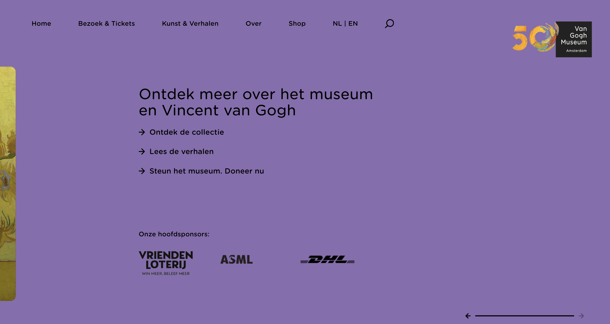

# Procesverslag
Markdown is een simpele manier om HTML te schrijven.  
Markdown cheat cheet: [Hulp bij het schrijven van Markdown](https://github.com/adam-p/markdown-here/wiki/Markdown-Cheatsheet).

Nb. De standaardstructuur en de spartaanse opmaak van de README.md zijn helemaal prima. Het gaat om de inhoud van je procesverslag. Besteedt de tijd voor pracht en praal aan je website.

Nb. Door *open* toe te voegen aan een *details* element kun je deze standaard open zetten. Fijn om dat steeds voor de relevante stuk(ken) te doen.

## Jij

  
uitwerken voor kick-off werkgroep

  ### Auteur:
  Betoel Fadallah

  #### Je startniveau:
  Mix van alle pisten (kon kiezen uit zwart, rood óf blauw)

  #### Je focus:
  Responsive ivm horizontale scroll. (kies uit responsive óf surface plane)
 

## Je website

  
uitwerken voor kick-off werkgroep

  ### Je opdracht:
  Dit is de site die ik ga namaken: https://www.vangoghmuseum.nl/nl
  De Home en Shop pagina zal ik volledig uitwerken. 

  #### Screenshot(s) van de eerste pagina (small screen): 
  Van Gogh homepage: 
  
  
  

  #### Screenshot(s) van de tweede pagina (small screen):
  hier de naam van de pagina  
  
  De shop pagina is wel anders dan de home, deze is weer verticaal mogelijk om te scrollen.
 

## Toegankelijkheidstest 1/2 (week 1)

  
uitwerken na test in 2e werkgroep

  ### Bevindingen
  Lijst met je bevindingen die in de test naar voren kwamen:

## Breakdownschets (week 1)

  
uitwerken na afloop 3e werkgroep

  ### de hele pagina: 
  

  ### dynamisch deel (bijv menu): 
  

  ### wellicht nog een dynamisch deel (bijv filter): 
  

## Voortgang 1 (week 2) - donderdag 30/11/2023

  
uitwerken voor 1e voortgang

  ### Stand van zaken
  hier dit ging goed & dit was lastig (neem ook screenshots op van delen van je website en code)

  Samen met studentassistent zijn we in de les van 30 november de 'Breakdown' opdracht gaan doornemen. Daarbij gaf hij aan om de in de header de dubbele navbar op te nemen. 
  
  

  Zelf twijfelde ik wat handig was over de opdeling hiervan, dus dit bracht mij tot een nieuwe inzicht. Daarnaast gaf hij aan dat mijn breakdown er prima uitzag en keken we verder naar de opdeling van de code en hoe de site als basis aangepakt kan worden. Voor op de home pagina had ik een aantal vragen over de uitdaging van de horizontale scroll effect. Ik dacht eerst aan het begin dat het verstandig was om de scroll effect als carrousel te zien, echt vond ik het idee om de de kaartjes beter in een list te stoppen, logischer. Dus heb ik mijn vraag voorgelegd aan hem, waarna hij het volgende op antwoordde: "Om eerst de horizontale scroll effect aan te pakken kun je het volgde regel toepassen":
  
  main {
     overflow-x: scroll;
     overflow-y: hidden;
  }

  Bron: https://developer.mozilla.org/en-US/docs/Web/CSS/overflow-x

  Ik heb deze regel toepgepast in mijn code nadat ik thuis aankwam, echter is het mij niet gelukt om deze werkend te krijgen. Morgen zal ik dit opnieuw proberen.

  Andere vraag die ik had over de Home page scroll effect was de kleur overgang van: geel- oranje naar paars. Hij gaf aan dat ik dit kon doen door vanaf een X aantal px breedte van het scherm, de kleur overgang geleidelijk kan laten overzetten naar een ander kleur. Dit kon ik beter later toepassen zei hij aangezien het voor nu niet heel dringend is voor de site.

  Ook zijn we gaan kijken naar de tweede Shop pagina, hij vond het  een goed idee dat ik de hele pagina omzet naar een Grid aangezien er veel gebeurd op de Van Gogh site en deze nog redelijk rommelig oogt. Hierin zag hij kansen om het mooier en professioneler te maken, daarbij kan een Grid veel impact leveren. 
  

  ### Verslag van meeting, hoofdlijnen in het kort:
  hier na afloop snel de uitkomsten van de meeting vastleggen

  - Breakdown sheet besproken (navbar fix).
  - Horizontale scroll effect= overflow-x: scroll;
  - Gradient break is verbonden aan X aantal px, hierover meer in een latere fase.
  - Grid kan ik goed toepassen op mijn tweede Shop pagina. 

## Voortgang 2 (week 3)

  
uitwerken voor 2e voortgang

  ### Stand van zaken
  hier dit ging goed & dit was lastig (neem ook screenshots op van delen van je website en code)

  ### Agenda voor meeting
  samen met je groepje opstellen

  | student 1      | student 2          | student 3    | student 4        |
  | ---            | ---                | ---          | ---              |
  | dit bespreken  | en dit             | en ik dit    | en dan ik dat    |
  | en dat ook nog | dit als er tijd is | nog een punt | dit wil ik zeker |
  | ...            | ...                | ...          | ...              |

  ### Verslag van meeting
  hier na afloop snel de uitkomsten van de meeting vastleggen

  - punt 1
  - punt 2
  - nog een punt
- ...

## Toegankelijkheidstest 2/2 (week 4)

  
uitwerken na test in 9e werkgroep

  ### Bevindingen
  Lijst met je bevindingen die in de test naar voren kwamen (geef ook aan wat er verbeterd is):

## Voortgang 3 (week 4) donderdag 11/01/2024

  
uitwerken voor 3e voortgang

  ### Stand van zaken
  hier dit ging goed & dit was lastig (neem ook screenshots op van delen van je website en code)

Donderdag 11 januari was de laatste voortgangsgesprek. Daarvoor wilde ik 

  ### Agenda voor meeting
  Vragen die ik wil stellen:
  1. Kleur overgang tijdens het horizontaal scrollen van de homepagina. Kan dit gedaan worden met css door middel van transform?
  2. Toegankelijkheid WCAG richtlijnen, welke moet ik aan houden?

  ### Verslag van meeting
  hier na afloop snel de uitkomsten van de meeting vastleggen.

  Tijdens het gesprek wilde ik graag meer te weten komen over hoe ik de kleur overgang op mijn homepagina het beste zou kunnen aanpakken. Zelf had ik transform gebruikt:
  
  transition: background-color 6s linear;

  En zo zag het er uit in mijn html 'body':
  
  body {
      padding-top: 1em;
      background-color: var(--color-background-yellow);
      transition: background-color 6s linear;
      font-family: var(--font-nunito);
      font-size: 1rem;
      line-height: 1.375;
  }

  Van Marten had ik geleerd dat ik dit het beste kon doen door de viewport van de totale width van het gehele horizontale scroll pagina, op te splitsen in drieën.

  

  Echter weet ik niet of dit mij zal lukken binnen de deadline, dus heb ik dit open laten staan voor een mogelijke bonus.

  Daarin had ik vermeld dat 
  - punt 2
  - nog een punt
  - ...

## Eindgesprek (week 5)

  
uitwerken voor eindgesprek

  ### Je uitkomst - karakteristiek screenshots:
  

  ### Dit ging goed/Heb ik geleerd: 
  Korte omschrijving met plaatjes

  

  ### Dit was lastig/Is niet gelukt:
  Korte omschrijving met plaatjes

  

## Bronnenlijst

  
continu bijhouden terwijl je werkt

  Nb. Wees specifiek ('css-tricks' als bron is bijv. niet specifiek genoeg). 
  Nb. ChatGpT en andere AI horen er ook bij.
  Nb. Vermeld de bronnen ook in je code.

  1. bron 1
  2. bron 2
  3. ...

